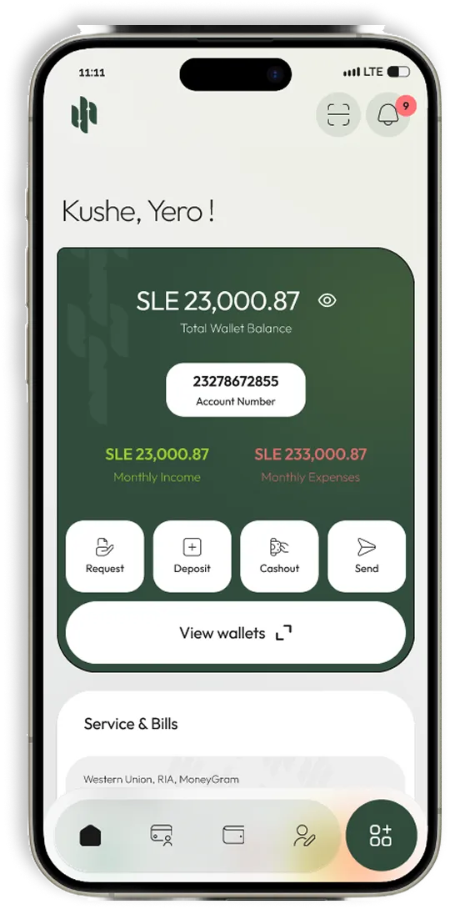
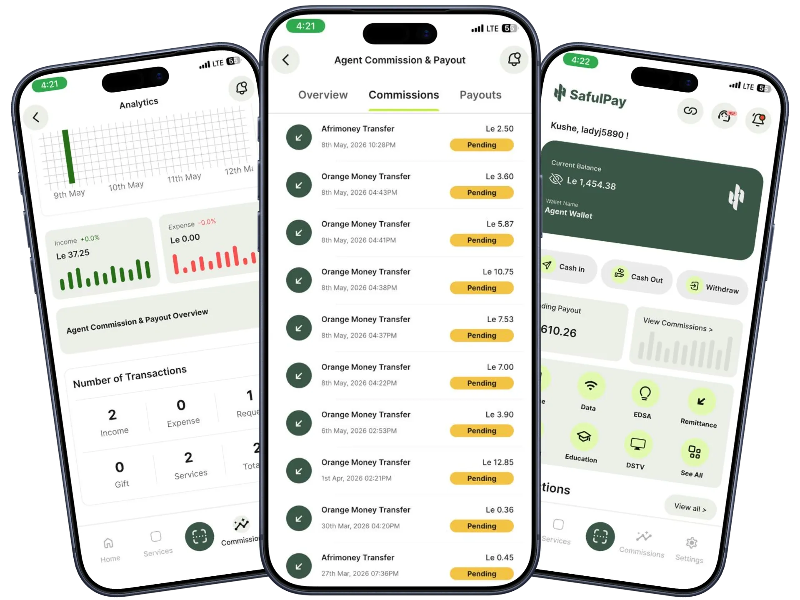
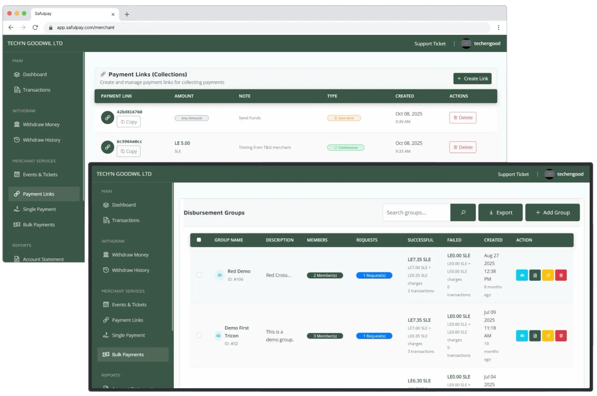

<p align="center">
  
</p>

<h1 align="center">SafulPay Website v2</h1>

<p align="center">
  
</p>

The marketing site for **SafulPay** — Sierra Leone's financial bridge that connects every wallet, bank, and bill into a single app. This repo is the public-facing site that tells that story to four audiences: end users, agents, merchants, and developers.

> _"One app sits in the middle of every wallet, bank and bill."_

---

## What the site covers

<p align="center">
  
</p>

| Section                  | What it sells                                                                                                             |
| ------------------------ | ------------------------------------------------------------------------------------------------------------------------- |
| **Home**                 | The pitch: one app for sending, paying bills (EDSA, WAEC, DSTV), buying airtime, and receiving remittances.               |
| **Bridge**               | The infrastructure narrative — mobile money networks, banks, and global remittance partners all flowing through SafulPay. |
| **Platform → Agency**    | Cash-in/out, bill collection, and commission tooling for agents across Sierra Leone.                                      |
| **Platform → Merchant**  | QR payments, payment links, bulk disbursements, and dashboards for businesses.                                            |
| **Platform → Developer** | A single REST API for mobile money, banks, bills, and remittances. Webhooks, idempotency, sandbox.                        |
| **About**                | Mission, team, and the people behind the platform.                                                                        |
| **Download**             | Direct links to the SafulPay mobile app.                                                                                  |

<p align="center">
  
  &nbsp;
  
</p>

---

## Tech stack

- **Next.js 16** — App Router, server components by default, `_components` co-location.
- **React 19** + **TypeScript** (strict).
- **Tailwind CSS v4** — design tokens via `@theme`, no separate config file.
- **GSAP + ScrollTrigger** — scroll-bound animations, smooth scrolling, persona crossfades.

---

## Getting started

```bash
npm install
npm run dev
```

Then open [http://localhost:3000](http://localhost:3000).

| Command         | What it does               |
| --------------- | -------------------------- |
| `npm run dev`   | Dev server with hot reload |
| `npm run build` | Production build           |
| `npm run start` | Serve the production build |
| `npm run lint`  | ESLint over the project    |

Node 20+ recommended.

---

## Project structure

```
src/
├── app/
│   ├── (app)/                  Route group — every marketing page
│   │   ├── about-us/           Mission, team, story
│   │   ├── download/           App store links
│   │   ├── platform/           Agency, Merchant, Developer use cases
│   │   ├── privacy/
│   │   └── terms-and-condition/
│   ├── _components/            Home page sections (Hero, Features, Works, etc.)
│   ├── HomeClient.tsx          Client-side home shell
│   ├── layout.tsx              Root layout + fonts + providers
│   ├── manifest.ts             PWA manifest
│   ├── robots.ts               robots.txt generator
│   ├── sitemap.ts              sitemap.xml generator
│   ├── not-found.tsx           404 page
│   └── page.tsx                Home entry
│
├── assets/                     Images, mockups, illustrations, team photos
├── components/
│   ├── layout/                 NavBar, Footer, ContactUs, MainFooter
│   ├── shared/                 Cross-route blocks (BridgeSection, Download, JsonLd)
│   └── ui/                     Primitives (SocialIcon, etc.)
├── context/
│   └── SmoothScrollProvider    Global smooth-scroll + sessionStorage scroll handoff
├── data/                       All copy lives here — never inline strings in components
│   ├── appContent.ts           Site-wide content (nav, footer, features, bridge, FAQs)
│   ├── companyData.ts          Mission, team, story, SEO
│   └── platformContent.ts      Platform page personas + use-case content
├── hooks/
│   ├── animations/             useSlideFadeIn, useScaleFadeIn, useHeaderAnimation
│   └── scroll/                 useSmoothScroll, getOffset
└── utils/                      iosScroll, gsapScrollTo
```

Co-located `_components/` directories are intentional — Next.js treats any folder prefixed with `_` as private, so child components stay scoped to the route that owns them.

---

## Conventions

### Content lives in `src/data/`

Components consume typed content from the data files. Don't inline copy in JSX — copy changes shouldn't require touching component code.

### Animations use the hooks

- `useSlideFadeIn` — slide + fade entrances (cards, sections, lists).
- `useScaleFadeIn` — pop-in effect for hero images, mockups, badges.
- `useHeaderAnimation` — split-text / staggered heading reveals.

All hooks accept a container ref and ScrollTrigger options. They register/cleanup via `gsap.context`, so they're safe to use multiple times per component.

### Smooth scrolling without hash pollution

`useSmoothScroll` handles all in-page nav. For cross-page section jumps (e.g. nav menu → `#bridge` from `/platform`), the target section ID is written to `sessionStorage` and the router pushes a clean URL. The home page reads `pendingScroll` on mount and scrolls into view. The URL never gets a `#bridge` suffix.

### Tailwind tokens

Theme tokens are defined in `@theme` inside `src/index.css`. Prefer:

- `bg-background` over `bg-white`
- `text-primary-color` (`#3a5646`) — SafulPay green
- `bg-secondary-color` (`#c3f02c`) — accent lime
- `text-text-color` over hardcoded `#121212`

Shades like `bg-primary-shade-5/10/30` already exist for translucent overlays.

### Stats and feature components are shared across platform sections

`StatsRow` and `FeatureRow` accept a `dark` prop so the same component renders cleanly on both light and dark sections. Don't duplicate the markup.

---

## Performance notes

- **Background fallback** — `body` has a `background-color: #0d0d0d` and three layered radial gradients matching the rose / green / lime glows of `background.webp`, so users see the right colors instantly while the asset loads.
- **Video illustration** in the Features section uses a static `<Image>` placeholder that crossfades to a muted, looping `<video>` only when `canPlay` fires. Respects `prefers-reduced-motion`.
- **Page videos** live in `public/` (not bundled through webpack), with `playsInline`, `pointer-events: none`, `disablePictureInPicture`, and `controlsList` set so they read as illustrations, not media players.

---

## Deployment

The site is built and deployed via Next.js standard output. Any platform that runs `next build && next start` (Vercel, Render, self-hosted Node) works.

Production canonical: [https://safulpay.com](https://safulpay.com)
